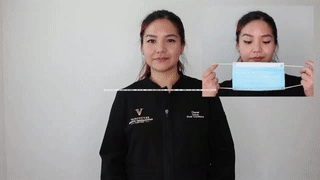
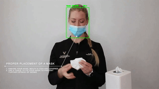
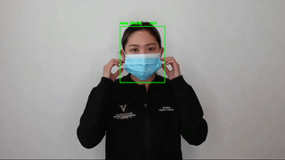
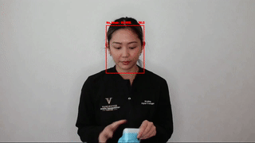

# COVID-19-SOP-Violation-Detection
COVID-19 SOP Violation Detection Computer Vision based Application | Face Mask Detection | Social Distancing

### Face Mask Detection
It detects whether people have wore a mask properly or not.

   
   

### Use Cases
Here are a few use cases where this mask detection technology could be leveraged.

* **Airports** 
   The Face Mask Detection System could be used at airports to detect travelers without masks. Face data of travelers can be captured in the system at the entrance. If a traveler is found to be without a face mask, their picture is sent to the airport authorities so that they could take quick action.
   
* **Hospitals** 
   Using Face Mask Detector System, Hospitals can monitor if quarantined people required to wear a mask are doing so or not. The same holds good for monitoring staff on duty too.
   
* **Offices & Working Spaces** 
   The Face Mask Detection System can be used at office premises to ascertain if employees are maintaining safety standards at work. It monitors employees without masks and sends them a reminder to wear a mask.
   
* **Government** 
   To limit the spread of coronavirus, the police could deploy the face mask detector on its fleet of surveillance cameras to enforce the compulsory wearing of face masks in public places.

   
